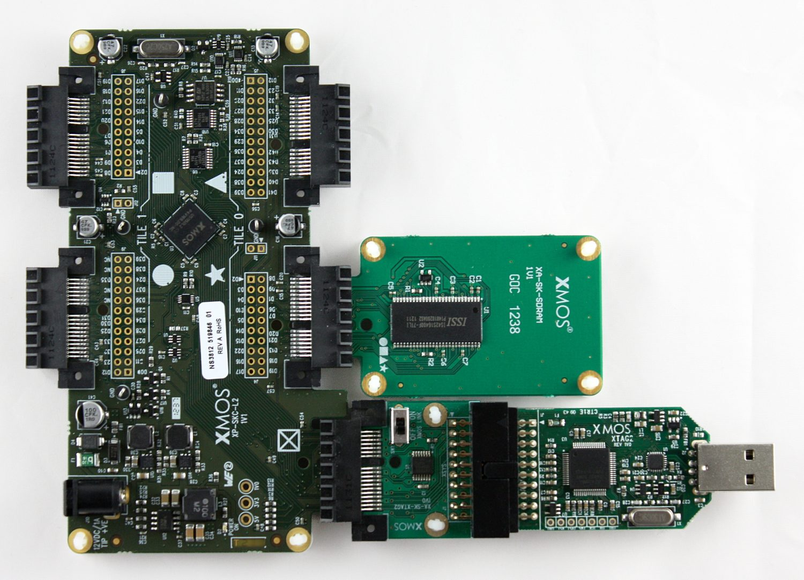

.. _Quad_SPI_flash_Demo_Quickstart:

Quad SPI flash demo quickstart guide
====================================

module_quad_spi_flash demo : Quick Start Guide
----------------------------------------------

This simple demonstration of xTIMEcomposer Studio functionality uses the XA-SK-FLASH Slice Card together with the xSOFTip ``module_quad_spi_flash`` to demonstrate how the module is used access the Quad SPI Flash.

Hardware Setup
++++++++++++++

The XP-SKC-L2 sliceKIT Core board has four slots with edge connectors: ``SQUARE``, ``CIRCLE``, ``TRIANGLE`` and ``STAR``. 

To setup up the system:

   #. Connect XA-SK-FLASH Slice Card to the XP-SKC-L2 sliceKIT Core board using the connector marked with the ``STAR``.
   #. Connect the XTAG Adapter to sliceKIT Core board, and connect XTAG-2 to the Adapter. 
   #. Connect the XTAG-2 to host PC. Note that the USB cable is not provided with the sliceKIT starter kit.
   #. Set the ``XMOS LINK`` to ``OFF`` on the XTAG Adapter.
   #. Switch on the power supply to the sliceKIT Core board.

   Hardware setup for quad SPI flash demo
   
	
Import and Build the Application
++++++++++++++++++++++++++++++++

   #. Open xTIMEcomposer and check that it is operating in online mode. Open the edit perspective (Window->Open Perspective->XMOS Edit).
   #. Locate the ``'sliceKIT Quad SPI Flash Demo'`` item in the xSOFTip pane on the bottom left of the window and drag it into the Project Explorer window in the xTIMEcomposer. This will also cause the modules on which this application depends (in this case, ``module_quad_spi_flash`` and ``module_slicekit_support``) to be imported as well. 
   #. Click on the ``app_quad_spi_flash_demo`` item in the Project Explorer pane then click on the build icon (hammer) in xTIMEcomposer. Check the console window to verify that the application has built successfully. There will be quite a number of warnings that ``bidirectional buffered port not supported in hardware``. These can be safely ignored for this component.

For help in using xTIMEcomposer, try the xTIMEcomposer tutorial, which you can find by selecting Help->Tutorials from the xTIMEcomposer menu.

Note that the Developer Column in the xTIMEcomposer on the right hand side of your screen provides information on the xSOFTip components you are using. Select the ``module_quad_spi_flash`` component in the Project Explorer, and you will see its description together with API documentation. Having done this, click the `back` icon until you return to this quickstart guide within the Developer Column.

Run the application
+++++++++++++++++++

Now that the application has been compiled, the next step is to run it on the sliceKIT Core Board using the tools to load the application over JTAG (via the XTAG2 and Xtag Adapter card) into the xCORE multicore microcontroller.

   #. Select the file ``app_quad_spi_flash_demo.xc`` in the ``app_quad_spi_flash_demo`` project from the Project Explorer.
   #. Click on the ``Run`` icon (the white arrow in the green circle). 
   #. At the ``Select Device`` dialog select ``XMOS XTAG-2 connect to L1[0..1]`` and click ``OK``.
   #. The debug console window in xTIMEcomposer should then display the message  ``Quad SPI flash demo complete``.
    
Next steps
++++++++++

Now that the demo has been run you could try and adjust the ``buffer[]`` initialisation. Initially, ``buffer[i] = i``, however this can be changed by modifying the return value of the ``f()`` function. If you choose to increase the size of the buffer then remember that the ``quad_spi_flash_write_page`` will only write 64 words at a time (a page), so you will need to modify this too.

